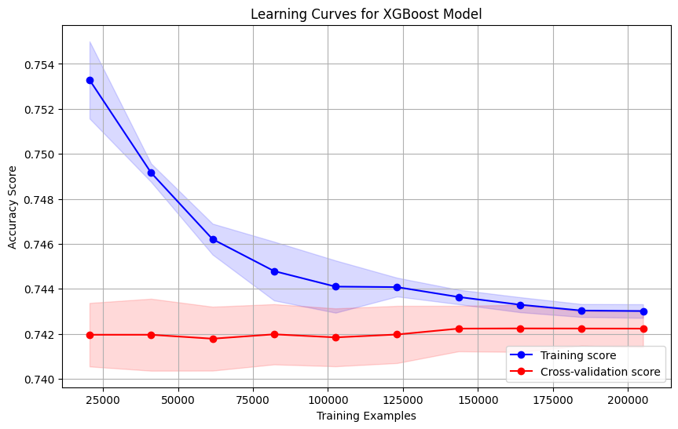

### XGBoost\_1

점수 : 0.7284963428

데이터셋 : X\_02 v3

\# XGBoost 모델 정의 및 학습  
model \= xgb.XGBClassifier(  
    max\_depth=6,  
    learning\_rate=0.1,  
    n\_estimators=200,  
    min\_child\_weight=1,  
    gamma=0,  
    subsample=0.8,  
    colsample\_bytree=0.8,  
    objective='binary:logistic',  
    random\_state=42  
)

\# 학습 곡선을 위한 데이터 준비  
train\_sizes, train\_scores, val\_scores \= learning\_curve(  
    model, X\_02, y,  
    train\_sizes=np.linspace(0.1, 1.0, 10),  
    cv=5,  
    n\_jobs=-1,  
    scoring='accuracy'  
)  
Accuracy: 0.7445  
AUC-ROC: 0.7271  
Precision: 0.5040  
Recall: 0.1149  
F1 Score: 0.1871

### XGBoost\_2

XGBoost\_1에서 v1데이터셋 이용  
점수 : 0.7291253408

데이터셋 : X\_02 v1

\# XGBoost 모델 정의 및 학습  
model \= xgb.XGBClassifier(  
    max\_depth=6,  
    learning\_rate=0.1,  
    n\_estimators=200,  
    min\_child\_weight=1,  
    gamma=0,  
    subsample=0.8,  
    colsample\_bytree=0.8,  
    objective='binary:logistic',  
    random\_state=42  
)

\# 학습 곡선을 위한 데이터 준비  
train\_sizes, train\_scores, val\_scores \= learning\_curve(  
    model, X\_02, y,  
    train\_sizes=np.linspace(0.1, 1.0, 10),  
    cv=5,  
    n\_jobs=-1,  
    scoring='accuracy'  
)  
Accuracy: 0.7446  
AUC-ROC: 0.7278  
Precision: 0.5056  
Recall: 0.1128  
F1 Score: 0.1845

Accuracy: 0.7107  
AUC-ROC: 0.7279  
Precision: 0.4381  
Recall: 0.4600  
F1 Score: 0.4488

### XGBoost\_3

XGBoost\_2에서 scale\_pos\_weight 추가  
scale\_pos\_weight \= neg / pos 으로 해보니 학습할수록 성능이 이전보다 훨씬 떨어지고 갈수록 개선 되지 않아서  
scale\_pos\_weight \= sqrt(neg / pos)으로 함

데이터셋 : X\_02 v1

class\_counts \= Counter(y\_train)  
neg, pos \= class\_counts\[0\], class\_counts\[1\]  
scale\_pos\_weight \= sqrt(neg / pos)  
print(scale\_pos\_weight)

\# XGBoost 모델 정의 및 학습  
model \= xgb.XGBClassifier(  
    max\_depth=6,  
    learning\_rate=0.1,  
    n\_estimators=200,  
    min\_child\_weight=1,  
    gamma=0,  
    subsample=0.8,  
    colsample\_bytree=0.8,  
    objective='binary:logistic',  
    scale\_pos\_weight=scale\_pos\_weight,  
    random\_state=42  
)

\# 학습 곡선을 위한 데이터 준비  
train\_sizes, train\_scores, val\_scores \= learning\_curve(  
    model, X\_02, y,  
    train\_sizes=np.linspace(0.1, 1.0, 10),  
    cv=5,  
    n\_jobs=-1,  
    scoring='accuracy'  
)  
  
Accuracy: 0.7107  
AUC-ROC: 0.7279  
Precision: 0.4381  
Recall: 0.4600  
F1 Score: 0.4488

\-\> Precision을 올리면서 Recall 유지하기 (Threshold 조정)

### XGBoost\_4

XGBoost\_3에서 Threshold 조정

점수: 0.7291972912

데이터셋 : X\_02 v1

\# ✅ Precision-Recall 곡선을 이용한 최적 임계값 조정  
precisions, recalls, thresholds \= precision\_recall\_curve(y\_val, y\_pred\_proba)

\# Precision과 Recall 균형 잡는 최적의 임계값 찾기  
optimal\_idx \= np.argmax(precisions \* recalls)  \# F1-score 최적화  
best\_threshold \= thresholds\[optimal\_idx\]

\# 새로운 임계값 적용  
y\_pred\_adjusted \= (y\_pred\_proba \>= best\_threshold).astype(int)

\# 최적화된 Precision, Recall 계산  
precision\_new \= precision\_score(y\_val, y\_pred\_adjusted)  
recall\_new \= recall\_score(y\_val, y\_pred\_adjusted)  
f1\_new \= f1\_score(y\_val, y\_pred\_adjusted)

print("\\n🔹 \*\*Optimized Threshold 적용 후 성능\*\* 🔹")  
print(f"Optimized Precision: {precision\_new:.4f}")  
print(f"Optimized Recall: {recall\_new:.4f}")  
print(f"Optimized F1 Score: {f1\_new:.4f}")

\# ✅ 최적 임계값을 test 데이터에도 적용  
test\_preds\_proba \= model.predict\_proba(test\_02)\[:, 1\]  
test\_preds \= (test\_preds\_proba \>= best\_threshold).astype(int)

\# test 데이터셋에 'ID' 컬럼 생성 (TEST\_00000, TEST\_00001 형식)  
test\["ID"\] \= \[f"TEST\_{str(i).zfill(5)}" for i in range(len(test))\]

\# 결과 저장  
submission \= pd.DataFrame({  
    'ID': test\["ID"\],  
    'probability': test\_preds\_proba  \# 최적 임계값 적용된 결과 사용  
})

Accuracy: 0.7107  
AUC-ROC: 0.7279  
Precision: 0.4381  
Recall: 0.4600  
F1 Score: 0.4488

🔹 \*\*Optimized Threshold 적용 후 성능\*\* 🔹  
Optimized Precision: 0.3302  
Optimized Recall: 0.9461  
Optimized F1 Score: 0.4895

### XGBoost\_5

XGBoost\_4에서 데이터전처리 변경

점수:0.7284953752

데이터셋 : X\_02 v3  
  
Accuracy: 0.7112  
AUC-ROC: 0.7269  
Precision: 0.4384  
Recall: 0.4565  
F1 Score: 0.4473

🔹 \*\*Optimized Threshold 적용 후 성능\*\* 🔹  
Optimized Precision: 0.3327  
Optimized Recall: 0.9400  
Optimized F1 Score: 0.4914

XGB는 데이터 특성이 적을수록 점수가 떨어지는 경향성이 있음..

### XGBoost\_6

점수:

데이터셋 : X\_02 v1  
파라미터를 조정함

model \= xgb.XGBClassifier(  
    max\_depth=6,  
    learning\_rate=0.05,   
    n\_estimators=500,  
    min\_child\_weight=1,  
    gamma=0,  
    subsample=0.8,  
    colsample\_bytree=0.8,  
    reg\_alpha=0.05,  
    reg\_lambda=2.0,  
    objective='binary:logistic',  
    scale\_pos\_weight=scale\_pos\_weight,  
    random\_state=42,  
    verbosity=1  
)  
  
Accuracy: 0.7105  
AUC-ROC: 0.7270  
Precision: 0.4376  
Recall: 0.4585  
F1 Score: 0.4478

🔹 \*\*Optimized Threshold 적용 후 성능\*\* 🔹  
Optimized Precision: 0.3292  
Optimized Recall: 0.9496  
Optimized F1 Score: 0.4890

Recall이 매우 높지만(0.9496) Precision이 낮아짐(0.3292)  \-\> 

### XGBoost\_7

점수 : 0.7304480995  
데이터셋 : X\_02 v1  
과적합 방지 및 정밀도 향상 중점으로 파라미터를 조정함  
모델의 복잡성을 줄이고(max\_depth 감소), 더 천천히 학습(learning\_rate 감소, n\_estimators 증가) 설정. min\_child\_weight와 gamma를 올려 모델이 더 보수적인 분할, 정규화 파라미터(reg\_alpha, reg\_lambda)를 강화, scale\_pos\_weight를 약간 낮춰 precision을 개선하고자 함

model \= xgb.XGBClassifier(  
    max\_depth=4,  
    learning\_rate=0.03,  
    n\_estimators=700,  
    min\_child\_weight=2,  
    gamma=0.1,  
    subsample=0.7,  
    colsample\_bytree=0.7,  
    reg\_alpha=0.1,  
    reg\_lambda=3.0,  
    scale\_pos\_weight=scale\_pos\_weight \* 0.8,  
    objective='binary:logistic',  
    random\_state=42,  
    verbosity=1  
)  
  
Accuracy: 0.7374  
AUC-ROC: 0.7291  
Precision: 0.4786  
Recall: 0.2903  
F1 Score: 0.3614

🔹 \*\*Optimized Threshold 적용 후 성능\*\* 🔹  
Optimized Precision: 0.3288  
Optimized Recall: 0.9516  
Optimized F1 Score: 0.4887

### XGBoost\_8

17분 59초

더 낮은 학습률과 더 많은 반복 횟수로 모델이 천천히 수렴하도록 파라미터 튜닝  
colsample\_bytree를 낮추어 각 트리가 사용하는 특성 수를 줄이고, reg\_alpha를 높여 불필요한 특성을 더 적극적으로 제거함. scale\_pos\_weight를 약간 조정하여 클래스 불균형 문제에 대응하면서도 precision을 향상시키고자 함.

model \= xgb.XGBClassifier(  
    max\_depth=5,  
    learning\_rate=0.02,  
    n\_estimators=1000,  
    min\_child\_weight=1.5,  
    gamma=0.05,  
    subsample=0.85,  
    colsample\_bytree=0.7,  
    reg\_alpha=0.2,  
    reg\_lambda=2.5,  
    scale\_pos\_weight=scale\_pos\_weight \* 0.9  
)

Accuracy: 0.7248  
AUC-ROC: 0.7290  
Precision: 0.4544  
Recall: 0.3731  
F1 Score: 0.4098

🔹 \*\*Optimized Threshold 적용 후 성능\*\* 🔹  
Optimized Precision: 0.3291  
Optimized Recall: 0.9511  
Optimized F1 Score: 0.4890

\-\> Accuracy가 떨어지는데 과적합인듯 보인다

### XGBoost\_9

25분 정도 걸림

매우 낮은 학습률과 많은 트리를 사용하여 모델이 더 정교하게 학습하도록 함  
subsample을 높여 더 많은 데이터를 사용하고, min\_child\_weight를 높여 노이즈에 덜 민감하게 만듬. 현재 scale\_pos\_weight를 유지하면서 다른 파라미터로 균형을 맞추는 방식.

model \= xgb.XGBClassifier(  
    max\_depth=5,  
    learning\_rate=0.01,  
    n\_estimators=1500,  
    min\_child\_weight=2,  
    gamma=0.03,  
    subsample=0.9,  
    colsample\_bytree=0.8,  
    reg\_alpha=0.15,  
    reg\_lambda=2.0,  
    scale\_pos\_weight=scale\_pos\_weight  
)  
  
Accuracy: 0.7115  
AUC-ROC: 0.7290  
Precision: 0.4398  
Recall: 0.4640  
F1 Score: 0.4516

🔹 \*\*Optimized Threshold 적용 후 성능\*\* 🔹  
Optimized Precision: 0.3309  
Optimized Recall: 0.9449  
Optimized F1 Score: 0.4901

\-\> Accuracy가 겁나 떨어짐… 과적합 방지 및 정밀도 향상 중점으로 파라미터를 조정하는 것이 가장 높은 Accuracy를 보였기 때문에 XGBoost\_7 튜닝 방향성으로 더 연구

### XGBoost\_10

시간: 13분 1초

Precision 강화 중점  
min\_child\_weight와 gamma를 더 높여 모델이 더욱 신중하게 예측하도록 하고, scale\_pos\_weight를 더 낮춰 Precision을 강화하고, regularization 강도를 올림

model \= xgb.XGBClassifier(  
    max\_depth=4,  
    learning\_rate=0.02,  
    n\_estimators=800,  
    min\_child\_weight=3,  
    gamma=0.2,  
    subsample=0.7,  
    colsample\_bytree=0.65,  
    reg\_alpha=0.15,  
    reg\_lambda=3.5,  
    scale\_pos\_weight=scale\_pos\_weight \* 0.7  
)  
  
Accuracy: 0.7408  
AUC-ROC: 0.7291  
Precision: 0.4872  
Recall: 0.2350  
F1 Score: 0.3171

🔹 \*\*Optimized Threshold 적용 후 성능\*\* 🔹  
Optimized Precision: 0.3307  
Optimized Recall: 0.9445  
Optimized F1 Score: 0.4899

### XGBoost\_11

시간: 12분 18초  
트리 구조 최적화 및 과적합 방지 중점  
max\_depth를 더 줄이고 reg\_lambda를 크게 증가시켜 과적합을 더욱 방지. 더 많은 트리(n\_estimators)와 약간 높은 learning\_rate로 복잡성 감소를 보완. colsample\_bytree를 낮춰 각 트리가 사용하는 특성 수를 더 제한하여 모델이 특정 패턴에 과도하게 집중하는 것을 방지.

model \= xgb.XGBClassifier(  
    max\_depth=3,  
    learning\_rate=0.025,  
    n\_estimators=1000,  
    min\_child\_weight=2.5,  
    gamma=0.15,  
    subsample=0.75,  
    colsample\_bytree=0.6,  
    reg\_alpha=0.2,  
    reg\_lambda=4.0,  
    scale\_pos\_weight=scale\_pos\_weight \* 0.75  
)  

Accuracy: 0.7391  
AUC-ROC: 0.7291  
Precision: 0.4828  
Recall: 0.2701  
F1 Score: 0.3464

🔹 \*\*Optimized Threshold 적용 후 성능\*\* 🔹  
Optimized Precision: 0.3388  
Optimized Recall: 0.9215  
Optimized F1 Score: 0.4955

\-\> F1 Score나 AUC-ROC가 더 중요하게 본다면 11이 10보다 좋은 모델이라고 본다. 그러나 Accuracy 자체는 10이 더 좋아 보이는데 잘 모르겠다

### XGBoost\_12

시간

특성 샘플링 및 앙상블 다양화 중점  
ubsample과 colsample\_bytree를, 그리고 추가로 colsample\_bylevel 파라미터를 도입하여 트리의 각 레벨에서 특성 샘플링을 다르게 적용. 이는 앙상블의 다양성을 높여 일반화 성능을 개선. 또한 reg\_alpha를 증가시켜 특성 선택을 더 강화.

model \= xgb.XGBClassifier(  
    max\_depth=4,  
    learning\_rate=0.015,  
    n\_estimators=1200,  
    min\_child\_weight=2,  
    gamma=0.1,  
    subsample=0.65,  
    colsample\_bytree=0.55,  
    colsample\_bylevel=0.7,  
    reg\_alpha=0.25,  
    reg\_lambda=3.0,  
    scale\_pos\_weight=scale\_pos\_weight \* 0.7  
)

  
Accuracy: 0.7403  
AUC-ROC: 0.7291  
Precision: 0.4850  
Recall: 0.2338  
F1 Score: 0.3155

🔹 \*\*Optimized Threshold 적용 후 성능\*\* 🔹  
Optimized Precision: 0.3357  
Optimized Recall: 0.9312  
Optimized F1 Score: 0.4935

\-\> F1 score 기준으로 11이 가장 자 나옴, 11의 방향성으로 더 개선.

### XGBoost\_13

시간:15분  
점수:

n\_estimators를 증가시켜 더 많은 트리를 학습하고, min\_child\_weight를 약간 높이고 gamma를 조정하여 더 신중한 분할을 유도하고, subsample과 colsample\_bytree의 균형을 맞추고, scale\_pos\_weight를 더 낮춰 Precision을 개선하는 방향

model \= xgb.XGBClassifier(  
    max\_depth=3,  
    learning\_rate=0.02,  
    n\_estimators=1200,  
    min\_child\_weight=3,  
    gamma=0.2,  
    subsample=0.8,  
    colsample\_bytree=0.65,  
    reg\_alpha=0.3,  
    reg\_lambda=3.5,  
    scale\_pos\_weight=scale\_pos\_weight \* 0.7  
)

  
 
Accuracy: 0.7410  
AUC-ROC: 0.7290  
Precision: 0.4880  
Recall: 0.2372  
F1 Score: 0.3192

🔹 \*\*Optimized Threshold 적용 후 성능\*\* 🔹  
Optimized Precision: 0.3364  
Optimized Recall: 0.9280  
Optimized F1 Score: 0.4938

### XGBoost\_14

시간:18분  
점수:

learning\_rate를 낮추고 n\_estimators를 크게 늘려 더 세밀하게 학습하도록 하고, reg\_alpha를 높여 불필요한 특성을 더 적극적으로 제거하고, colsample\_bylevel 파라미터를 추가하여 트리의 각 레벨에서 특성 선택을 최적화 방향

model \= xgb.XGBClassifier(  
    max\_depth=3,  
    learning\_rate=0.015,  
    n\_estimators=1500,  
    min\_child\_weight=2.5,  
    gamma=0.15,  
    subsample=0.75,  
    colsample\_bytree=0.6,  
    colsample\_bylevel=0.75,  
    reg\_alpha=0.4,  
    reg\_lambda=4.0,  
    scale\_pos\_weight=scale\_pos\_weight \* 0.7  
)

  

Accuracy: 0.7408  
AUC-ROC: 0.7289  
Precision: 0.4873  
Recall: 0.2378  
F1 Score: 0.3196

🔹 \*\*Optimized Threshold 적용 후 성능\*\* 🔹  
Optimized Precision: 0.3282  
Optimized Recall: 0.9511  
Optimized F1 Score: 0.4880

### XGBoost\_15

시간:24분 16초  
점수:

max\_depth를 더 낮추고 min\_child\_weight를 높여 매우 간단한 트리를 많이 만들어 앙상블하는 전략. learning\_rate를 매우 낮게 설정하고 n\_estimators를 대폭 증가시켜 천천히 학습하도록 함. 특성 샘플링 파라미터(colsample\_bytree, colsample\_bylevel, colsample\_bynode)를 세밀하게 조정하여 다양한 트리를 생성하고, scale\_pos\_weight를 크게 낮춰 Precision에 더 중점을 둠.

model \= xgb.XGBClassifier(  
    max\_depth=2,  
    learning\_rate=0.01,  
    n\_estimators=2000,  
    min\_child\_weight=3.5,  
    gamma=0.12,  
    subsample=0.7,  
    colsample\_bytree=0.55,  
    colsample\_bylevel=0.8,  
    colsample\_bynode=0.8,  
    reg\_alpha=0.35,  
    reg\_lambda=3.0,  
    scale\_pos\_weight=scale\_pos\_weight \* 0.65  
)

 
 
Accuracy: 0.7429  
AUC-ROC: 0.7273  
Precision: 0.4941  
Recall: 0.1860  
F1 Score: 0.2702

🔹 \*\*Optimized Threshold 적용 후 성능\*\* 🔹  
Optimized Precision: 0.3279  
Optimized Recall: 0.9491  
Optimized F1 Score: 0.4875

→ 13이 가장 v1 score가 높았고 15는 Accuracy는 높지만 기본 F1 Score가 낮아짐. 이 둘을 잘 섞어서 방향성을 진행

### XGBoost\_16

시간:20분 18초  
점수:

11 실험 세트 최적화 및 균형 개선 방향으로  
learning\_rate를 약간 낮추고 n\_estimators를 늘려 더 세밀하게 학습하도록 하고, min\_child\_weight와 gamma의 미세 조정을 통해 의사결정 경계를 최적화하고, scale\_pos\_weight를 약간 더 낮춰 Precision과 Recall의 균형을 개선 방향

model \= xgb.XGBClassifier(  
    max\_depth=3,  
    learning\_rate=0.018,  
    n\_estimators=1400,  
    min\_child\_weight=2.8,  
    gamma=0.22,  
    subsample=0.82,  
    colsample\_bytree=0.67,  
    reg\_alpha=0.28,  
    reg\_lambda=3.2,  
    scale\_pos\_weight=scale\_pos\_weight \* 0.68  
)

 
Accuracy: 0.7420  
AUC-ROC: 0.7290  
Precision: 0.4913  
Recall: 0.2207  
F1 Score: 0.3046

🔹 \*\*Optimized Threshold 적용 후 성능\*\* 🔹  
Optimized Precision: 0.3376  
Optimized Recall: 0.9250  
Optimized F1 Score: 0.4947

### XGBoost\_17

시간:20분 01초  
점수:

트리 앙상블의 다양성을 극대화하기 위해 세 가지 다른 특성 샘플링 파라미터를 모두 활용. 또한 max\_delta\_step 파라미터를 도입하여 각 트리의 가중치 업데이트를 제한함으로써 더 안정적인 학습을 유도. 이를 통해 모델이 일부 특성이나 패턴에 과도하게 의존하는 것을 방지하는 방향

model \= xgb.XGBClassifier(  
    max\_depth=3,  
    learning\_rate=0.015,  
    n\_estimators=1600,  
    min\_child\_weight=3.2,  
    gamma=0.18,  
    subsample=0.78,  
    colsample\_bytree=0.63,  
    colsample\_bylevel=0.72,  
    colsample\_bynode=0.85,  
    reg\_alpha=0.35,  
    reg\_lambda=3.5,  
    scale\_pos\_weight=scale\_pos\_weight \* 0.72,  
    max\_delta\_step=1  
)  
  
  
Accuracy: 0.7398  
AUC-ROC: 0.7288  
Precision: 0.4844  
Recall: 0.2526  
F1 Score: 0.3321

🔹 \*\*Optimized Threshold 적용 후 성능\*\* 🔹  
Optimized Precision: 0.3390  
Optimized Recall: 0.9212  
Optimized F1 Score: 0.4956

### XGBoost\_18

시간:29분 4초  
점수

grow\_policy='lossguide'와 max\_leaves 파라미터를 도입하여 전통적인 레벨 기반 트리 성장 대신 손실 감소를 기반으로 트리를 구성하도록 함. 이는 비대칭적인 트리를 생성하여 복잡한 패턴을 더 효과적으로 포착할 수 있음. 또한 max\_depth와 max\_leaves의 균형을 맞춰 트리의 복잡성을 최적화.

model \= xgb.XGBClassifier(  
    max\_depth=4,  
    learning\_rate=0.01,  
    n\_estimators=2000,  
    min\_child\_weight=2.5,  
    gamma=0.2,  
    subsample=0.85,  
    colsample\_bytree=0.7,  
    colsample\_bylevel=0.8,  
    reg\_alpha=0.25,  
    reg\_lambda=3.0,  
    scale\_pos\_weight=scale\_pos\_weight \* 0.73,  
    max\_delta\_step=2,  
    grow\_policy='lossguide',  
    max\_leaves=32  
)  

### XGBoost\_19

16에서 scale\_pos\_weight\*6으로 변경

model \= xgb.XGBClassifier(  
    max\_depth=3,  
    learning\_rate=0.018,  
    n\_estimators=1400,  
    min\_child\_weight=2.8,  
    gamma=0.22,  
    subsample=0.82,  
    colsample\_bytree=0.67,  
    reg\_alpha=0.28,  
    reg\_lambda=3.2,  
    scale\_pos\_weight=scale\_pos\_weight \* 0.6  
)  
 
Accuracy: 0.7446  
AUC-ROC: 0.7290  
Precision: 0.5053  
Recall: 0.1188  
F1 Score: 0.1923

🔹 \*\*Optimized Threshold 적용 후 성능\*\* 🔹  
Optimized Precision: 0.3384  
Optimized Recall: 0.9231  
Optimized F1 Score: 0.4952

### XGBoost\_20

시간: 17분 42초  
16에서 scale\_pos\_weight\*5으로 변경

model \= xgb.XGBClassifier(  
    max\_depth=3,  
    learning\_rate=0.018,  
    n\_estimators=1400,  
    min\_child\_weight=2.8,  
    gamma=0.22,  
    subsample=0.82,  
    colsample\_bytree=0.67,  
    reg\_alpha=0.28,  
    reg\_lambda=3.2,  
    scale\_pos\_weight=scale\_pos\_weight \* 0.5  
)

### XGBoost\_21

16에서 scale\_pos\_weight\*4으로 변경

model \= xgb.XGBClassifier(  
    max\_depth=3,  
    learning\_rate=0.018,  
    n\_estimators=1400,  
    min\_child\_weight=2.8,  
    gamma=0.22,  
    subsample=0.82,  
    colsample\_bytree=0.67,  
    reg\_alpha=0.28,  
    reg\_lambda=3.2,  
    scale\_pos\_weight=scale\_pos\_weight \* 0.4  
)

### XGBoost\_22

16에서 scale\_pos\_weight\*6, learning\_rate=0.01

model \= xgb.XGBClassifier(  
    max\_depth=3,  
    learning\_rate=0.01,  
    n\_estimators=1400,  
    min\_child\_weight=2.8,  
    gamma=0.22,  
    subsample=0.82,  
    colsample\_bytree=0.67,  
    reg\_alpha=0.28,  
    reg\_lambda=3.2,  
    scale\_pos\_weight=scale\_pos\_weight \* 0.6  
)  
Accuracy: 0.7441  
AUC-ROC: 0.7283  
Precision: 0.5006  
Recall: 0.1243  
F1 Score: 0.1992

🔹 \*\*Optimized Threshold 적용 후 성능\*\* 🔹  
Optimized Precision: 0.3363  
Optimized Recall: 0.9260  
Optimized F1 Score: 0.4934

### XGBoost\_23

시간: 17분

X\_02를 5만개 샘플링 하여 Optuna를 사용한 하이퍼파라미터 최적화 해서 적용

model \= xgb.XGBClassifier(  
    max\_depth= 5,   
    learning\_rate= 0.4731260184717807,   
    n\_estimators= 6800,   
    colsample\_bytree= 0.9483493063780918,   
    colsample\_bylevel= 0.7656978149864536,   
    colsample\_bynode= 0.5041208268795553,   
    reg\_lambda= 0.7160605653655732,   
    reg\_alpha= 0.24681661258185134,   
    subsample= 0.7970114522440143,   
    min\_child\_weight= 8,   
    gamma= 0.4384837611891634,   
    scale\_pos\_weight= 0.3027455093707247  
)  
Accuracy: 0.7440  
AUC-ROC: 0.7215  
Precision: 0.5333  
Recall: 0.0018  
F1 Score: 0.0036

🔹 \*\*Optimized Threshold 적용 후 성능\*\* 🔹  
Optimized Precision: 0.3268  
Optimized Recall: 0.9523  
Optimized F1 Score: 0.4866

### XGBoost\_24

시간: 17분 39초

X\_02를 5만개 샘플링 하여 Optuna를 사용한 하이퍼파라미터 최적화 해서 적용  
Accuracy: 0.7439  
AUC-ROC: 0.7265  
Precision: 0.4286  
Recall: 0.0005  
F1 Score: 0.0009

🔹 \*\*Optimized Threshold 적용 후 성능\*\* 🔹  
Optimized Precision: 0.3289  
Optimized Recall: 0.9499  
Optimized F1 Score: 0.4886